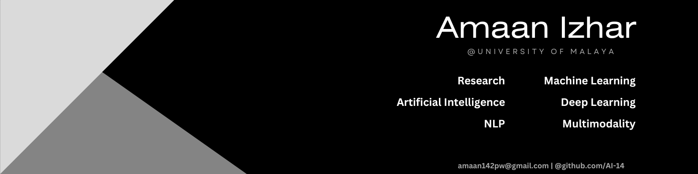

<h1 align="center"> Hi 👋, I am Amaan Izhar </h1>

  

## /about-me
- 🎓 I am a Master's of Computer Science student @ [University of Malaya](https://um.edu.my/) / [FCSIT](https://fsktm.um.edu.my/).
  - My research is supervised/co-supervised by: [Dr. Norisma Idris](https://umexpert.um.edu.my/norisma) & [Dr. Nurul Japar](https://umexpert.um.edu.my/nuruljapar).
  - [Curriculum Vitae.]()
<!---
- I am also collborating with the [Artificial Intelligence Research Group](https://fsktm.um.edu.my/research-group-ai).
-->
  
- 📚 I’m currently preparing my thesis and a journal paper under the field of _Artificial Intelligence and Deep Learning in Medical Image Analysis & Radiology Report Generation_.
- 👯 I’m looking to collaborate on Machine Learning & Deep Learning projects/papers related to my research interests.
- 💬 I am passionate about research and new-ideas that glue together interdisciplinary fields via Machine Learning & Deep Learning technologies. Furthermore, I am working my way to earn a PhD eventually and contribute significantly towards academic research under AI-ML. 
- ⚡ Fun Facts:
  - I like to read technical books.
  - I love to listen raps & violin OSTs.
  - I kill time by watching anime/tv-shows.
  - I like to have conversations about code/computer-science/philosophical topics in general.

## /research-interests
- Interdisciplinary Machine Learning & Deep Learning.
- Multimodal Representation/Architectures.
- Natural Language Processing.
  
## /skills
- **_Programming Languages_**:
  
       
- **_Databases_**:

   
- **_AI-ML_**:

       
- **_Web_**:

       
- **_Miscellaneous_**:

    
  
## /publications
> _coming soon_...

## /contact-me
**_Let's connect, collaborate, and have a conversation about potential papers/projects related to AI-ML._**

